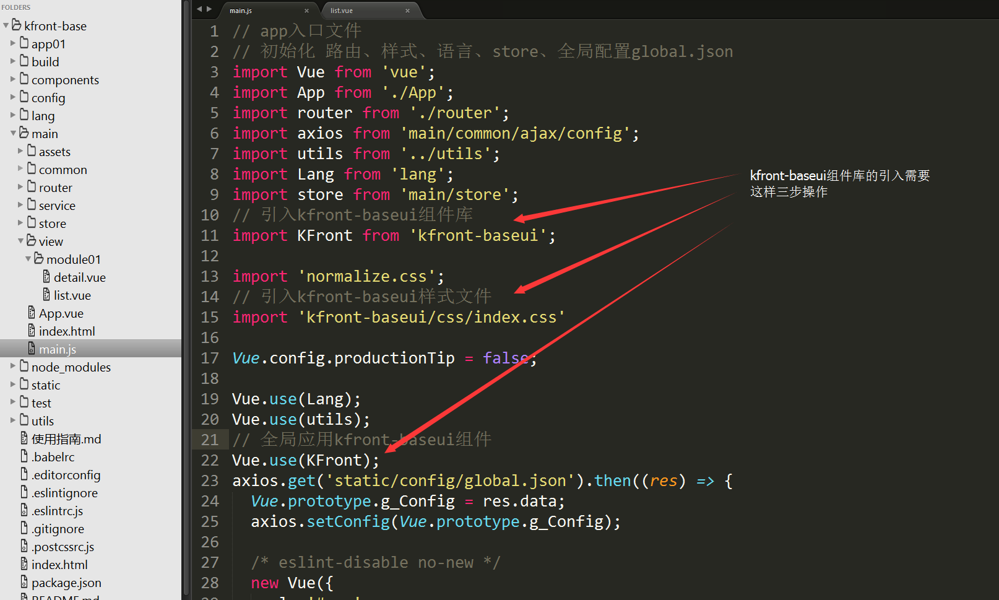
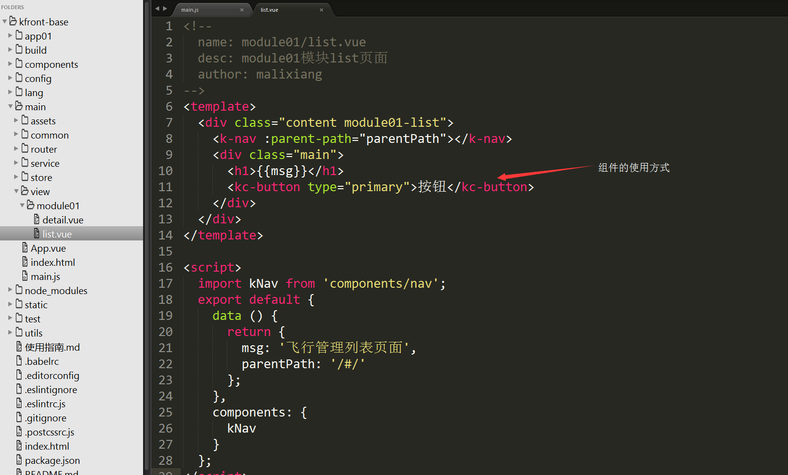

### KFront-BaseUI

#### KFront-BaseUI发布日志

2018-07-10

	kfront-baseui@1.0.7

#### 1. 综述

KFront-BaseUI是一款基于Vue.js(2.*)与ElementUI开发定制的UI解决方案。

开发者可在KFront-Base体系内使用该UI组件库。

根据公司业务项目需求，提炼出更凝练的交互设计和视觉风格。

开箱即用的Vue.js(2.*)组件库。

#### 2. 设计原则

一致性

提高开发效率

简化操作流程

样式可扩展

#### 3. 快速上手

进入项目根目录，运行下述命令，安装依赖

```
npm\cnpm install --save kfront-baseui
```

如需要安装特定版本，请使用下述命令

```
npm\cnpm install --save kfront-baseui@1.0.7
```

依赖安装结束以后，在项目中引入kfront-baseui,打开子工程中main.js文件

1 引入组件库主文件

```
import KFront from 'kfront-baseui';
```

2 引用样式

```
import 'kfront-baseui/css/index.css';
```

3 全局应用组件库

```
Vue.use(KFront);
```

详细代码请参阅下图



#### 之后，便可以在项目中使用kfront-baseui，使用方式如下图，详细使用文档参阅本页内容


