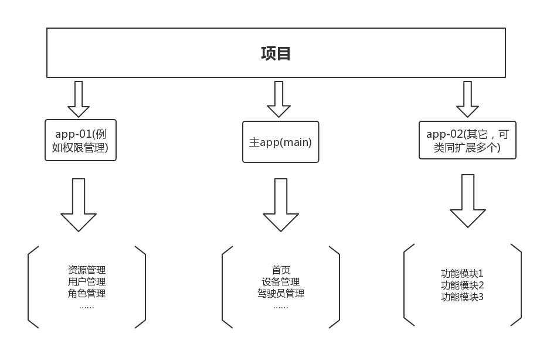

### KFront-Base

> Front-Base是科达Web前端技术部结合之前使用Vue、Element-UI、Webpack等技术进行前端项目开发总结出的一整套前端工程化体系，主要包含两个部分：脚手架和UI解决方案。

### 设计目的

降低学习成本

提高开发效率

### 设计原则

** 规范化 **

> 编码规范、项目架构

** 模块化 **

> 按模块组织页面逻辑

** 工程化 **

> 集成前端自动化工具：es6转es5、scss转css、图片处理、图标字体库、代码压缩、各类loader等等。

** 组件化 **

> UI解决方案：KFront-Base-UI

### 项目架构

