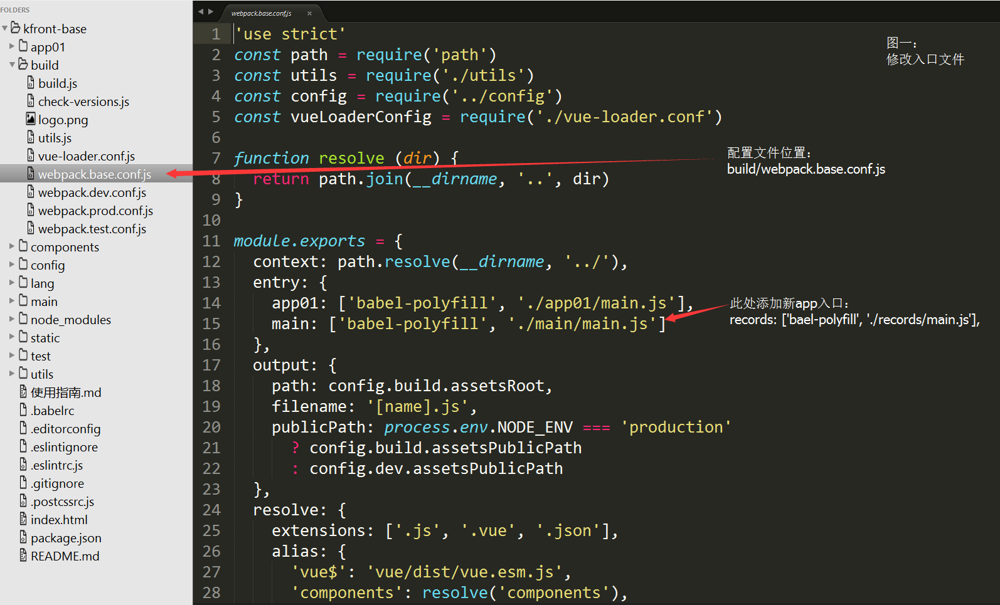
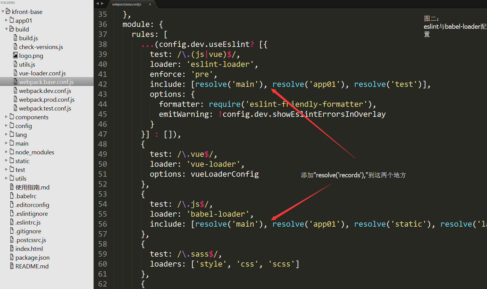
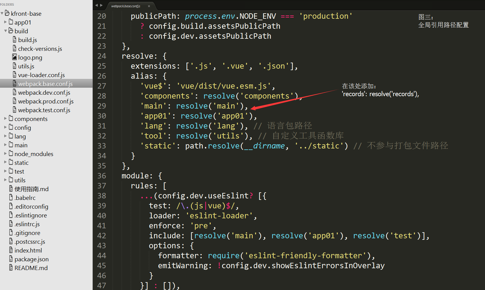
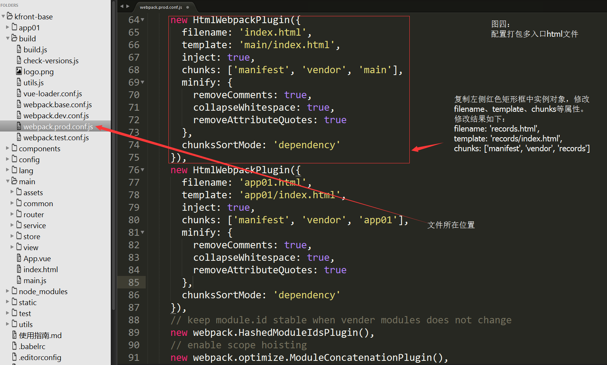
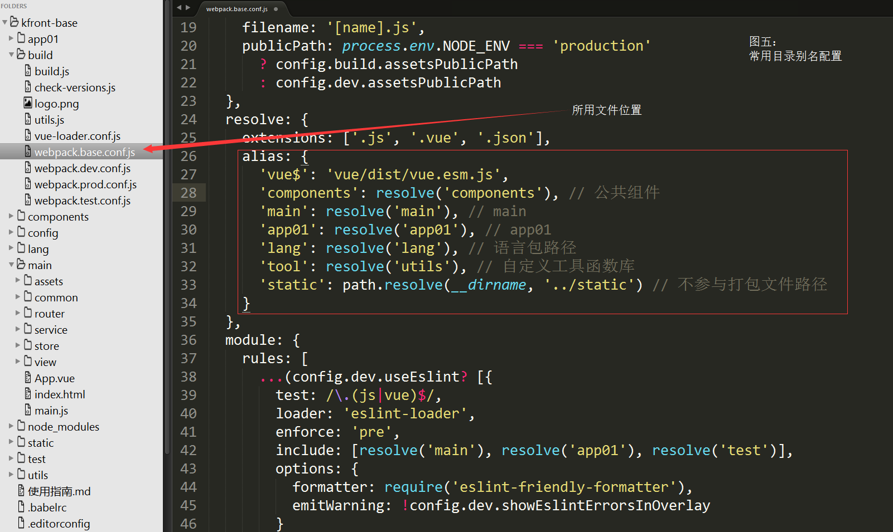
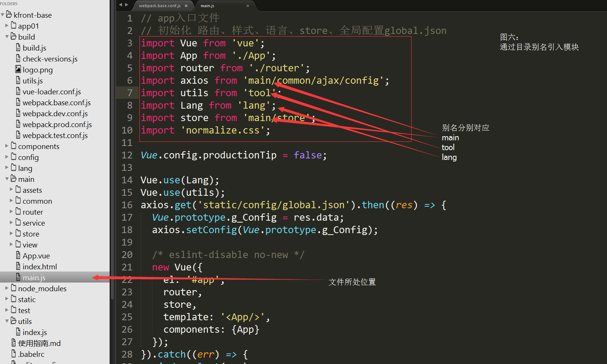

KFront-Base
===========

### 路由
路由是页面之间的跳转逻辑，对于SPA来说，以Vue技术栈为例，路由通过vue-router实现。
在MPA中，路由是html页面之间的跳转，通过原生a链接跳转即可。

> SPA--Single Page Application

> MPA--Multi Page Application

#### 单页路由的配置
在项目中，每个app有自己独立的路由配置文件，以main（主app）为例，其路由配置所在目录为：

```
main/router/index.js
```
有关vue-router的使用，详情请参考：
[vue-router](https://router.vuejs.org/)
或
[vue-router中文](https://router.vuejs.org/zh/guide/#html)

#### 多页路由的配置
形如：
```
<a href="/app01.html#/device-manager"></a>
```

### 新建app

当项目需要新建一个app，用以扩充更多更重的功能模块时，需要进行如下配置（v1.0.×版本）：

1、复制app01目录（该目录用来做模板，建议保留），粘贴，根据需要取名，比如records（历史记录）

2、修改webpack配置

文件目录地址：build/webpack.base.conf.js

具体修改，详见下图：









3、替换records（新app）中引入路径

在目录records全局搜索“app01”，将所有引用路径替换为“records”

### 常用路径引用

为了方便开发者引入具体的目录，在webpack.base.conf.js中配置目录别名，具体如下图：



在相应app中如果需要引入这些目录，可通过下图中的方式处理：




